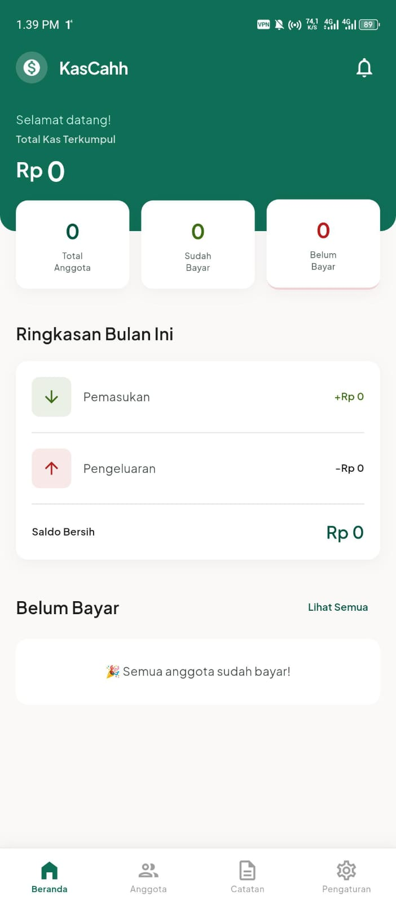
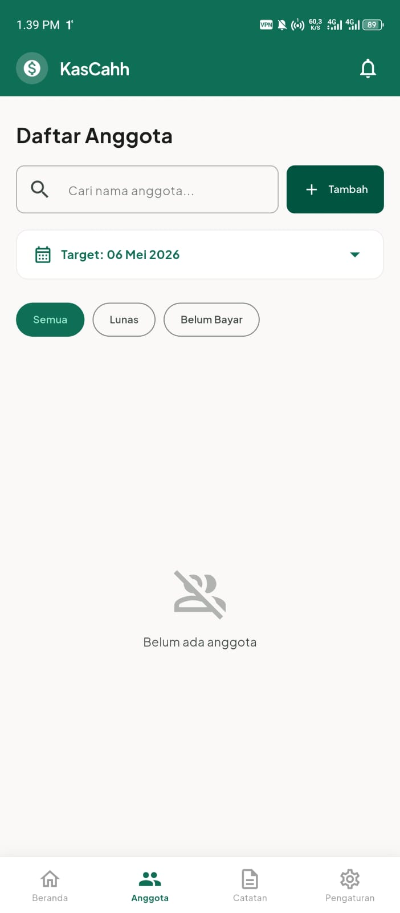
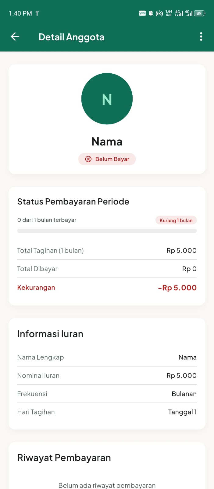
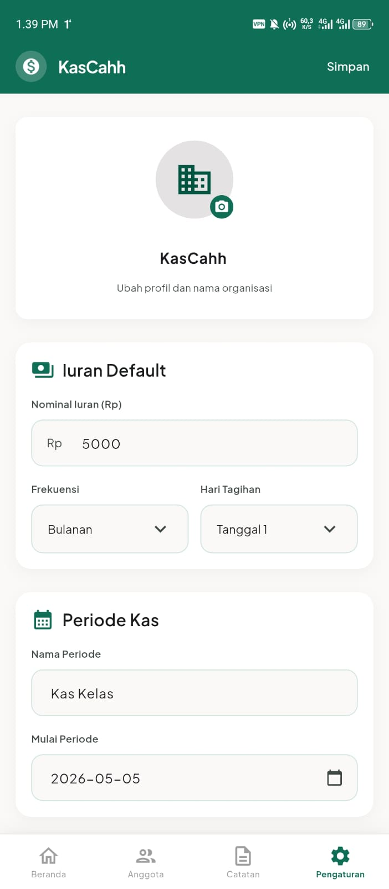

# 💰 KasCahh - Aplikasi Manajemen Kas

<div align="center">


Aplikasi Flutter untuk mengelola kas dan iuran anggota dengan mudah dan efisien.

[Fitur](#-fitur-utama) • [Instalasi](#-cara-menjalankan) • [Dokumentasi](#-struktur-project) • [Build](#-build-production)

</div>

---

## 📱 Fitur Utama

### ✅ Manajemen Anggota
- Tambah, edit, dan hapus anggota
- Upload foto profil anggota
- Pencarian anggota
- Filter anggota (Semua, Lunas, Belum Bayar)
- Detail riwayat pembayaran per anggota

### 💰 Pencatatan Keuangan
- Catat pembayaran iuran (Tunai/Transfer)
- Catat pengeluaran dengan kategori
- Tracking status pembayaran (Lunas/DP)
- Perhitungan otomatis tagihan berdasarkan periode

### 📊 Dashboard & Laporan
- Ringkasan kas terkumpul
- Statistik anggota (Total, Sudah Bayar, Belum Bayar)
- Ringkasan pemasukan dan pengeluaran bulanan
- Saldo bersih real-time

### 🔔 Notifikasi
- Pengingat tagihan harian (08:00)
- Notifikasi anggota belum bayar
- Izin notifikasi Android/iOS

### 📤 Export Data
- Export rekap kas ke CSV
- Export pengeluaran bulanan ke CSV
- Share file via aplikasi lain

### ⚙️ Pengaturan Fleksibel
- Kustomisasi nama dan logo aplikasi
- Atur nominal iuran default
- Pilih frekuensi iuran (Harian/Mingguan/Bulanan)
- Atur periode kas
- Reset data

## � Screenshots

<div align="center">

| Dashboard | Anggota | Pembayaran | Pengaturan |
|-----------|---------|------------|------------|
|  |  |  |  |

</div>

> **Note**: Tambahkan screenshot aplikasi di folder `screenshots/`

---

## �🚀 Cara Menjalankan

### Prasyarat
- Flutter SDK `^3.11.5`
- Dart SDK `^3.11.5`
- Android Studio / VS Code dengan Flutter extension
- Emulator atau device fisik (Android/iOS)
- Git

### Instalasi

1. **Clone repository**
```bash
git clone <repository-url>
cd KasCahh
```

2. **Install dependencies**
```bash
flutter pub get
```

3. **Verifikasi instalasi**
```bash
flutter doctor
```

4. **Jalankan aplikasi**
```bash
# Mode debug
flutter run

# Mode release
flutter run --release

# Pilih device spesifik
flutter run -d <device-id>
```

5. **Lihat daftar device**
```bash
flutter devices
```

## 📦 Dependencies

### Core Dependencies
| Package | Version | Fungsi |
|---------|---------|--------|
| **google_fonts** | ^8.1.0 | Font kustom (Plus Jakarta Sans) |
| **image_picker** | ^1.2.2 | Upload foto profil anggota |
| **shared_preferences** | ^2.5.2 | Penyimpanan data lokal |
| **csv** | ^8.0.0 | Export data ke format CSV |
| **path_provider** | ^2.1.5 | Akses file system device |
| **share_plus** | ^13.1.0 | Share file ke aplikasi lain |
| **flutter_local_notifications** | ^21.0.0 | Notifikasi lokal |
| **permission_handler** | ^12.0.1 | Manajemen izin aplikasi |
| **timezone** | ^0.11.0 | Timezone untuk scheduling notifikasi |

### Update Dependencies
```bash
# Update semua dependencies
flutter pub upgrade

# Update dependency tertentu
flutter pub upgrade <package_name>
```

## 🏗️ Struktur Project

```
lib/
├── main.dart                 # Entry point aplikasi
├── models/
│   └── app_data.dart        # Model data & state management
├── screens/
│   ├── beranda_screen.dart          # Dashboard
│   ├── anggota_screen.dart          # Daftar anggota
│   ├── catatan_screen.dart          # Catatan pengeluaran
│   ├── pengaturan_screen.dart       # Pengaturan
│   ├── detail_anggota_screen.dart   # Detail anggota
│   ├── tambah_anggota_sheet.dart    # Form tambah anggota
│   ├── catat_pembayaran_sheet.dart  # Form pembayaran
│   └── tambah_pengeluaran_sheet.dart # Form pengeluaran
├── services/
│   ├── notification_service.dart    # Service notifikasi
│   └── export_service.dart          # Service export CSV
└── widgets/
    ├── bottom_nav.dart              # Bottom navigation
    ├── stat_card.dart               # Card statistik
    ├── summary_row.dart             # Row ringkasan
    ├── member_card.dart             # Card anggota
    └── anggota_list_card.dart       # Card list anggota
```

## 🎨 Design System

### Color Palette
```dart
Primary Color:           #005440  // Hijau Tua
Primary Container:       #0F6E56  // Hijau Medium
Secondary Container:     #D3E7E0  // Hijau Muda
Tertiary Container:      #3B6D11  // Hijau Olive
Surface:                 #FBF9F8  // Off-White
```

### Typography
- **Font Family**: Plus Jakarta Sans
- **Weights**: Regular (400), Medium (500), SemiBold (600), Bold (700)

### Components
- Rounded corners: 12px
- Card elevation: 2
- Bottom sheet: Rounded top corners (24px)

---

## 📝 Status Project

### ✅ Completed Features
- [x] Manajemen anggota lengkap (CRUD)
- [x] Pencatatan pembayaran & pengeluaran
- [x] Dashboard dengan statistik real-time
- [x] Notifikasi pengingat tagihan
- [x] Export data ke CSV
- [x] Pengaturan aplikasi fleksibel
- [x] Upload & display foto profil
- [x] Filter & search anggota
- [x] Perhitungan otomatis tagihan

### 🎯 Production Ready
- ✅ Tidak ada error kompilasi
- ✅ Semua warning BuildContext sudah diperbaiki
- ✅ Dependencies kompatibel dan up-to-date
- ✅ Siap untuk build production (APK/AAB/IPA)

---

## 🔧 Build Production

### Android APK (Debug)
```bash
flutter build apk --debug
```

### Android APK (Release)
```bash
flutter build apk --release
```

### Android App Bundle (untuk Play Store)
```bash
flutter build appbundle --release
```

### iOS (Release)
```bash
flutter build ios --release
```

### Build dengan Split APK (per ABI)
```bash
flutter build apk --split-per-abi
```

### Lokasi File Build
- **APK**: `build/app/outputs/flutter-apk/`
- **AAB**: `build/app/outputs/bundle/release/`
- **iOS**: `build/ios/iphoneos/`

---

## 🐛 Troubleshooting

### Error: "Gradle build failed"
```bash
cd android
./gradlew clean
cd ..
flutter clean
flutter pub get
flutter run
```

### Error: "CocoaPods not installed" (iOS)
```bash
sudo gem install cocoapods
cd ios
pod install
cd ..
flutter run
```

### Notifikasi tidak muncul
1. Pastikan izin notifikasi sudah diberikan
2. Cek pengaturan notifikasi di device
3. Restart aplikasi setelah memberikan izin

### Foto tidak bisa diupload
1. Pastikan izin kamera/galeri sudah diberikan
2. Cek `AndroidManifest.xml` dan `Info.plist` untuk permission
3. Restart aplikasi setelah memberikan izin

### Data hilang setelah update
- Data disimpan di `SharedPreferences` (lokal device)
- Uninstall aplikasi akan menghapus semua data
- Gunakan fitur export CSV untuk backup data

---

## 📱 Platform Support

| Platform | Status | Min Version |
|----------|--------|-------------|
| Android  | ✅ Supported | API 21 (Android 5.0) |
| iOS      | ✅ Supported | iOS 12.0+ |
| Web      | ⚠️ Not tested | - |
| Desktop  | ❌ Not supported | - |

---

## 🤝 Contributing

Ini adalah private project. Jika ingin berkontribusi:

1. Fork repository
2. Buat branch baru (`git checkout -b feature/AmazingFeature`)
3. Commit perubahan (`git commit -m 'Add some AmazingFeature'`)
4. Push ke branch (`git push origin feature/AmazingFeature`)
5. Buat Pull Request

### Code Style
- Gunakan `flutter format` sebelum commit
- Ikuti [Effective Dart](https://dart.dev/guides/language/effective-dart) guidelines
- Tambahkan komentar untuk logika kompleks

---

## 📄 Lisensi

Private project - tidak untuk dipublikasikan ke pub.dev

---

## 👨‍💻 Developer

Dibuat menggunakan Flutter oleh **Al**

### Contact
- 📧 Email: alasama351@gmail.com

---

<div align="center">

**⭐ Star project ini jika bermanfaat!**

Made with Flutter 

</div>
